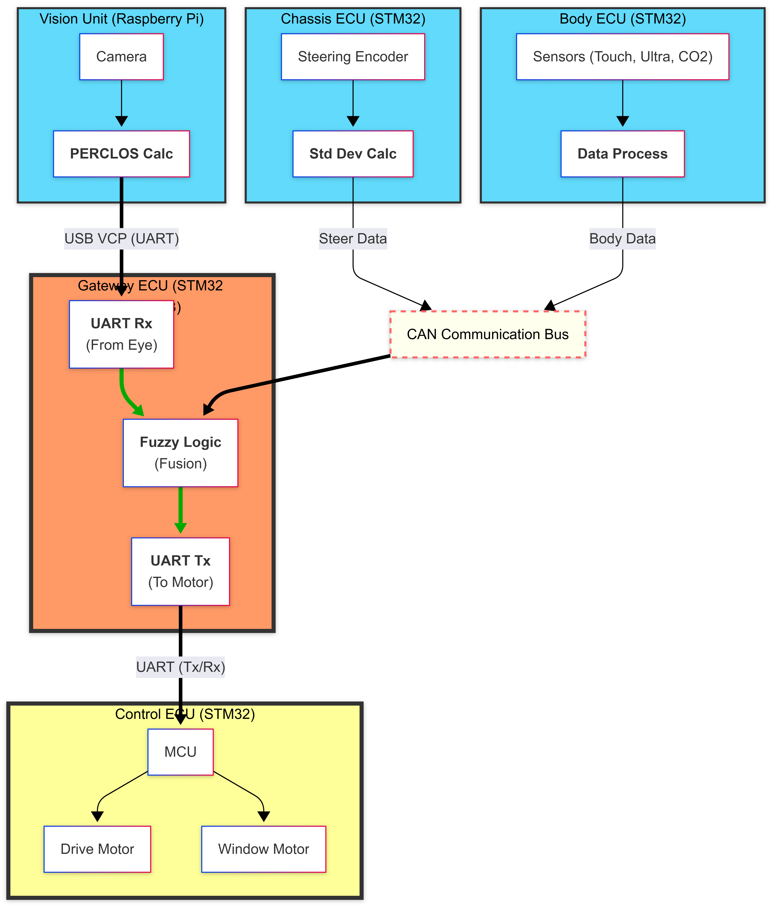

# Highway-Drowsiness-Prevention
SeSAC 임베디드 모빌리티 교육 과정 프로젝트의 고속도로 주행 졸음 방지 및 운전 보조 시스템

### Directory
```text
Project_Root/  
├── 📂 Docs/                 # 요구사항 명세서, ICD 엑셀, 회로도, 데이터시트  
├── 📂 Firmware/             # STM32 (Nucleo) 소스코드  
│   ├── 📂 Common/           # 공통 파일  
│   ├── 📂 Chassis/          # 핸들/엔코더 제어  
│   ├── 📂 Body/             # 초음파/터치 센서  
│   ├── 📂 Gateway/          # 게이트웨이  
│   └── 📂 Control/          # 모터 제어  
├── 📂 Software/             # RPi (Vision) 소스코드  
│   ├── 📂 Vision/           # 파이썬, OpenCV 코드  
│   └── 📂 Tests/            # 단위 테스트용 스크립트  
└── 📄 README.md             # 프로젝트 개요  
```
### Requirements
👉 [요구사항 명세서 Google Docs](https://docs.google.com/spreadsheets/d/1GA2fsIz_X9MGZ1jV-OMV5jceq43T6OOZGFUdi2Nr6kI/edit?usp=sharing)

### SW Architecture
  

### ICD (Interface Control Document)
👉 [ICD Google Docs](https://docs.google.com/spreadsheets/d/1sVhbBkO5iRFneAzjhkxMpAqBnwXrGZptWKL747l2oKY/edit?usp=sharing)
